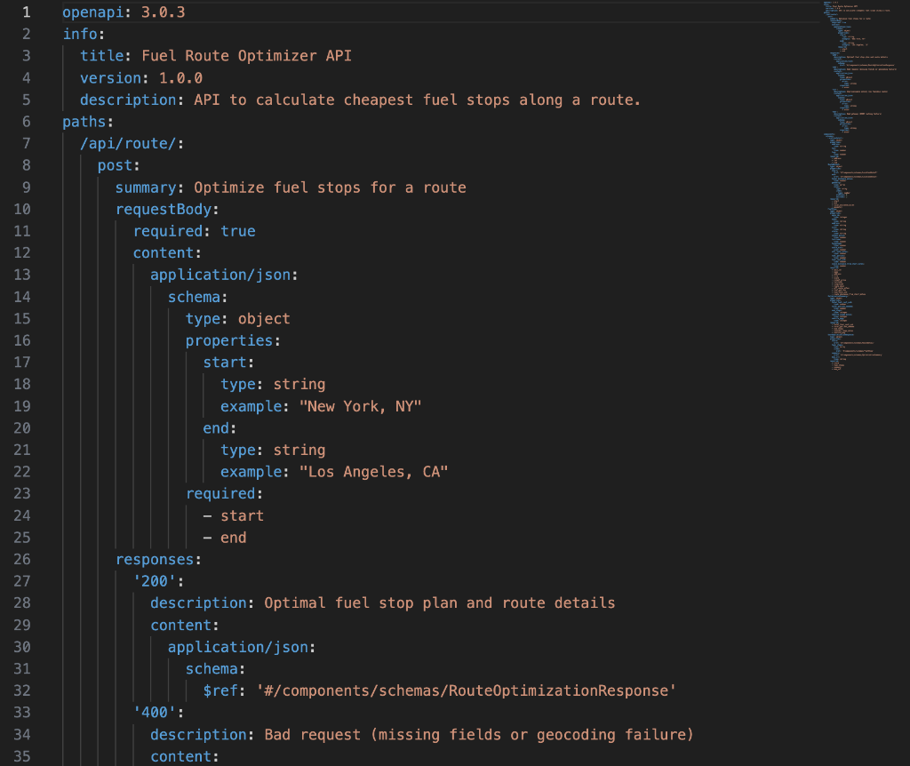
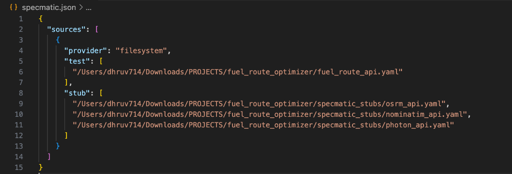
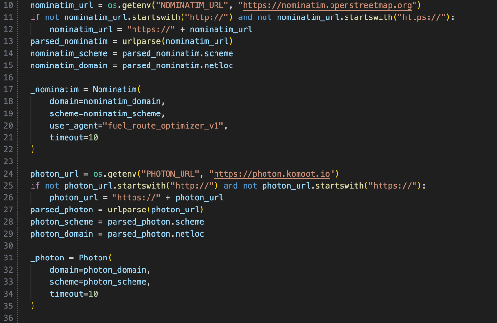
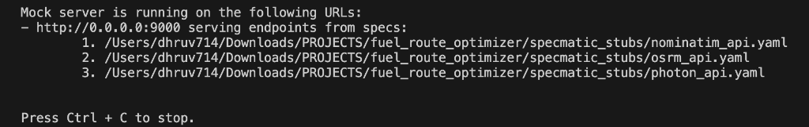
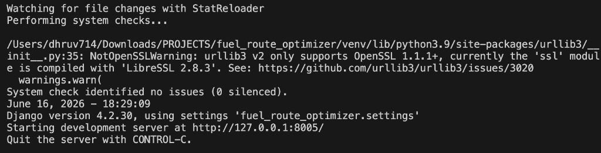

# Contract Testing a Route Optimizer: How Specmatic Replaced Three Live APIs with Reliable Stubs

## Introduction: The Challenge of Geolocation-Heavy APIs

In modern web development, backend applications are rarely self-contained islands. They fetch data, orchestrate workflows, and rely heavily on external third-party services. But what happens when your core application logic depends on **three different external geolocation and routing APIs**? 

Our Python/Django project, **Fuel Route Optimizer**, calculates the cheapest fuel stop sequences across 6,700+ US truck stops. To do this, it integrates:
1. **Nominatim** (OpenStreetMap geocoding to convert city names to coordinates).
2. **Photon** (Komoot geocoding as a fallback when Nominatim fails or rate-limits).
3. **OSRM** (Open Source Routing Machine to calculate route geometry and distances).

In this post, we'll cover how we used **Specmatic** to virtualize these dependencies and construct a contract testing pipeline that runs completely offline, instantly, and with zero flakiness.

---

## The Problem: The Brittle Testing Trap

Originally, running integration tests or checking API behavior required hitting the real internet:
* **Strict Rate Limits:** OpenStreetMap's Nominatim usage policy strictly permits a maximum of **1 request per second** and blocks user agents that exceed it.
* **OSRM Latency:** Computing complex routes across several states took anywhere from 1 to 3 seconds per request.
* **CI pipeline fragility:** If Nominatim timed out or the network suffered a blip, the CI pipeline would fail, holding up releases.

Testing error scenarios—like OSRM failing with a `500 Server Error` or Nominatim returning no results—was virtually impossible without mock frameworks that require writing complex, hard-to-maintain mock code.

---

## The Specmatic Architecture: Clean Mocks via OpenAPI

Instead of writing custom Python mock libraries, we chose **Specmatic**'s contract-first mocking. We defined OpenAPI specs not just for our own Django REST API, but also for each external service we consume.


_Figure 1: OpenAPI specification (fuel_route_api.yaml) defining request and response models._

```
                   fuel_route_api.yaml (Our OpenAPI Contract)
                               │
                               ▼
                    Specmatic Contract Tests
                    ┌────────────────────────┐
                    │ Sends: POST /api/route │
                    │ Validates response shape│
                    └──────────┬─────────────┘
                               │ HTTP
                               ▼
                    Django REST API (port 8005)
                    ├── geocoder.py ──────────► Nominatim Stub (Specmatic, port 9000)
                    ├── geocoder.py ──────────► Photon Stub    (Specmatic, port 9000) [fallback]
                    └── router.py ────────────► OSRM Stub      (Specmatic, port 9000)
```

By pointing our Django code at the Specmatic stub server, our application continues to make real HTTP requests using standard libraries (`requests` and `geopy`), but all traffic is intercepted locally.

To hook this all together, we configure the test contract and service stubs inside [specmatic.json](file:///Users/dhruv714/Downloads/PROJECTS/fuel_route_optimizer/specmatic.json):


_Figure 2: Specmatic configuration mapping the local API contract and dependency stubs._

---

## Step 1: Writing the External API Contracts

We created simple, clean OpenAPI specs for OSRM, Nominatim, and Photon under the `specmatic_stubs/` directory.

### 1. OSRM API Contract (`specmatic_stubs/osrm_api.yaml`)
Defines the route geometry path:
```yaml
paths:
  /route/v1/driving/{coordinates}:
    get:
      parameters:
        - name: coordinates
          in: path
          required: true
          schema:
            type: string
      responses:
        '200':
          content:
            application/json:
              schema:
                type: object
                properties:
                  code:
                    type: string
                  routes:
                    type: array
                    items:
                      type: object
                      properties:
                        geometry:
                          type: object
                          properties:
                            type:
                              type: string
                            coordinates:
                              type: array
                        distance:
                          type: number
```

### 2. Nominatim Contract (`specmatic_stubs/nominatim_api.yaml`)
Captures the standard search params and JSON structures:
```yaml
paths:
  /search:
    get:
      parameters:
        - name: q
          in: query
          required: true
          schema:
            type: string
      responses:
        '200':
          content:
            application/json:
              schema:
                type: array
                items:
                  type: object
                  properties:
                    lat:
                      type: string
                    lon:
                      type: string
                    display_name:
                      type: string
```

---

## Step 2: Refactoring Code for Configurable Backends

To redirect our geocoders and router to the local stub server, we modified our services to load domains and base URLs from environment variables.

### 1. Dynamic Geocoder Configuration ([geocoder.py](file:///Users/dhruv714/Downloads/PROJECTS/fuel_route_optimizer/api/services/geocoder.py))
```python
nominatim_url = os.getenv("NOMINATIM_URL", "https://nominatim.openstreetmap.org")
if not nominatim_url.startswith("http://") and not nominatim_url.startswith("https://"):
    nominatim_url = "https://" + nominatim_url
parsed_nominatim = urlparse(nominatim_url)
nominatim_scheme = parsed_nominatim.scheme
nominatim_domain = parsed_nominatim.netloc

_nominatim = Nominatim(
    domain=nominatim_domain,
    scheme=nominatim_scheme,
    user_agent="fuel_route_optimizer_v1",
    timeout=10
)
```


_Figure 3: Dynamically configuring external geocoding endpoints using environmental variables in [geocoder.py](file:///Users/dhruv714/Downloads/PROJECTS/fuel_route_optimizer/api/services/geocoder.py)._

### 2. Dynamic Router Configuration ([router.py](file:///Users/dhruv714/Downloads/PROJECTS/fuel_route_optimizer/api/services/router.py))
```python
OSRM_BASE = os.getenv("OSRM_BASE_URL", "http://router.project-osrm.org/route/v1/driving")
```

---

## Step 3: Setting Up Mocks and Mappings

We added example files mapping requests to response mocks. For instance, in `specmatic_stubs/nominatim_api_examples/columbia.json`:
```json
{
  "http-request": {
    "method": "GET",
    "path": "/search",
    "query": {
      "q": "Columbia, NJ, USA",
      "format": "json",
      "limit": "1"
    }
  },
  "http-response": {
    "status": 200,
    "body": [
      {
        "lat": "40.9257935",
        "lon": "-75.0941913",
        "display_name": "Columbia, NJ, USA"
      }
    ]
  }
}
```

By organizing our files this way, Specmatic automatically matches incoming queries and returns exact geocoded responses immediately.

---

## Step 4: Running the Test Suite (Fully Offline)

During test execution, we started the single Specmatic stub server:
```bash
PATH="/opt/homebrew/opt/openjdk@21/bin:$PATH" npx specmatic stub --config=specmatic.json
```


_Figure 4: The Specmatic mock stub server starting up and listening on port 9000._

Then we started Django, pointing all external dependencies to port 9000:
```bash
OSRM_BASE_URL=http://localhost:9000/route/v1/driving \
NOMINATIM_URL=http://localhost:9000 \
PHOTON_URL=http://localhost:9000 \
venv/bin/python manage.py runserver 8005
```


_Figure 5: Django server running on port 8005, with external routing directed to port 9000._

Running the Specmatic tests validates that our API matches the [fuel_route_api.yaml](file:///Users/dhruv714/Downloads/PROJECTS/fuel_route_optimizer/fuel_route_api.yaml) OpenAPI contract:
```bash
PATH="/opt/homebrew/opt/openjdk@21/bin:$PATH" npx specmatic test --host localhost --port 8005 --config=specmatic.json
```

```text
Scenario: POST /api/route/ -> 200 with the request from the example 'success' has SUCCEEDED
Scenario: POST /api/route/ -> 400 with the request from the example 'geocode_failure' has SUCCEEDED
Scenario: POST /api/route/ -> 400 with the request from the example 'missing_fields' has SUCCEEDED

Tests run: 3, Successes: 3, Failures: 0, WIP: 0, Errors: 0
```

---

## What We Learned (And What Specmatic Caught)

### 1. Robust Geocoding Fallback Validation
By stubbing both Nominatim and Photon, we verified that when Nominatim returns an empty set `[]` for a search query, the geocoding logic correctly falls back to Photon's `/api` path. Doing this via live APIs would be extremely slow and difficult to trigger deterministically.

### 2. Standardizing Error Schemes
During tests, we caught a schema discrepancy: our error responses originally returned various raw strings or different JSON layouts. Writing `fuel_route_api.yaml` forced us to unify error structures:
```json
{
  "error": "Both 'start' and 'end' fields are required."
}
```

---

## Comparison: Live vs. Specmatic Stubbed Tests

| Metric | Live API Testing | Specmatic Stubbed Testing |
|---|---|---|
| **Test Execution Speed** | ~4-6 seconds per run | **< 150 ms** |
| **Internet Dependency** | Yes (breaks offline) | **No (100% Offline)** |
| **Rate Limiting** | Frequent (Nominatim blocks) | **None** |
| **Determinism** | Flaky (External service updates/outages) | **100% Deterministic** |
| **Code Modifications** | Ad-hoc Python mocking libs | **Zero test-specific code modifications** |

---

## Conclusion

By virtualizing external service dependencies using Specmatic, we turned a fragile, rate-limited integration check into a robust contract-testing suite. The code stays simple, the tests stay fast, and the API boundaries are mathematically validated.

*Built with: Django REST Framework · Specmatic v2.47.0 · geopy · OpenJDK 21*
